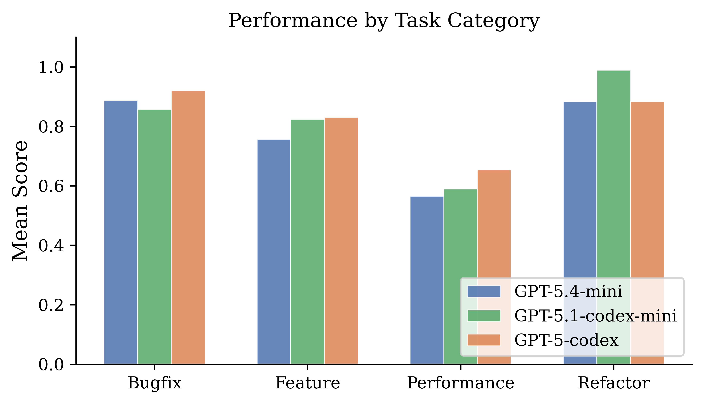
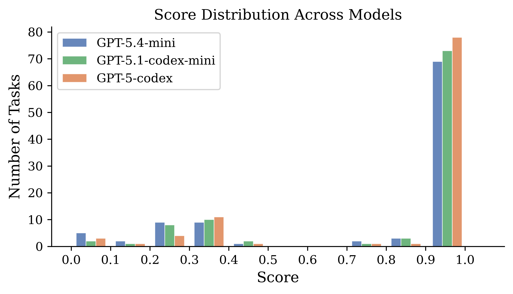

# nx-bench

An unsaturated evaluation benchmark for coding agents, built from real merged pull requests in [NetworkX](https://github.com/networkx/networkx). Applies the [SWE-bench](https://github.com/princeton-nlp/SWE-bench) methodology to a repository not included in any known coding agent benchmark, using [mini-swe-agent](https://github.com/SWE-agent/mini-swe-agent) as the agent scaffold.

**[Paper (PDF)](nx-bench-report.pdf)**

---

## Key Results

Three OpenAI models evaluated on 100 tasks, with 0% error rate across all 300 runs:

| Model | Mean Score | Pass@1 | Targeted Pass Rate | Regression Pass Rate |
|-------|-----------|--------|-------------------|---------------------|
| **GPT-5-codex** | **0.842** | **78%** | 0.794 | 0.953 |
| GPT-5.1-codex-mini | 0.822 | 73% | 0.764 | 0.957 |
| GPT-5.4-mini | 0.784 | 69% | 0.725 | 0.923 |

*Pass@1 = fraction of tasks scoring >= 0.9*

### Performance by Category

| Model | Bugfix (n=29) | Feature (n=51) | Performance (n=11) | Refactor (n=9) |
|-------|:---:|:---:|:---:|:---:|
| GPT-5-codex | 0.920 | 0.831 | 0.655 | 0.883 |
| GPT-5.1-codex-mini | 0.856 | 0.823 | 0.589 | **0.989** |
| GPT-5.4-mini | 0.887 | 0.756 | 0.565 | 0.883 |

### Category Breakdown



### Score Distribution



The distribution is strongly **bimodal**: tasks are either solved near-perfectly (>= 0.9) or largely failed (< 0.5), with virtually no tasks in between. This suggests agents either fully grasp the required change or fail to engage with it meaningfully.

### Key Findings

- **GPT-5-codex is the strongest overall** (0.842 mean, 78% pass@1), excelling at bugfixes (0.920).
- **Performance optimization is the hardest category** across all models (0.565--0.655), requiring algorithmic complexity reasoning rather than functional correctness.
- **GPT-5.1-codex-mini dominates refactoring** (0.989) despite being a smaller model --- code reorganization may favor more focused reasoning.
- **The benchmark is unsaturated**: no model exceeds 78% pass@1, with 8--16 tasks per model scoring below 0.3.

---

## How It Works

The benchmark follows the SWE-bench methodology applied to NetworkX:

1. **Mine** merged PRs from [networkx/networkx](https://github.com/networkx/networkx) via the GitHub API (3,091 PRs mined, 200 candidates filtered)
2. **Construct tasks**: For each PR, roll back the repo to the pre-PR state, then apply the PR's test changes so new tests exist but fail
3. **Run agents**: Each model gets the PR description and must modify source code to make failing tests pass, using [mini-swe-agent](https://github.com/SWE-agent/mini-swe-agent) with a local environment
4. **Score in Docker**: Each patch is scored in an isolated container using the repo's own test suite

```
Agent Phase (local, parallel)              Scoring Phase (Docker, parallel)
+---------------------------------+        +----------------------------------+
| For each (task, model):         |        | For each patch:                  |
|   1. git worktree @ base_sha   |        |   1. docker run nx-eval          |
|   2. Apply test patch (fail)    | -----> |   2. Apply agent patch           |
|   3. mini-swe-agent edits code  |        |   3. pytest targeted tests       |
|   4. Capture diff               |        |   4. pytest regression tests     |
+---------------------------------+        |   5. Output JSON scores          |
                                           +----------------------------------+
```

Models run concurrently (one thread per model), with 5 parallel agents per model and 10 concurrent Docker scoring containers.

---

## Task Distribution

100 tasks selected via stratified sampling from real merged PRs:

| Category | Count | Description |
|----------|:-----:|-------------|
| Feature | 51 | New algorithms, API additions, parameter support |
| Bugfix | 29 | Incorrect results, edge case failures, type errors |
| Performance | 11 | Algorithm optimizations, complexity improvements |
| Refactor | 9 | Code reorganization, API simplification |

Tasks span diverse algorithmic domains: shortest paths, centrality, graph traversal, network generators, I/O parsers, and linear algebra.

---

## Scoring

Composite score in [0, 1] using only the repo's own test suite --- no hand-written checks:

```
score = 0.70 * targeted_test_pass_rate + 0.30 * regression_pass_rate
```

| Component | Weight | Measures |
|-----------|:------:|----------|
| Targeted test pass rate | 0.70 | Did the agent make the PR's fail-to-pass tests pass? |
| Regression pass rate | 0.30 | Do existing module tests still pass? |

- Doing nothing scores ~0.30 (existing tests pass, targeted tests fail)
- Solving cleanly scores 1.0
- Solving but breaking existing tests is penalized

---

## Repository Structure

| File | Purpose |
|------|---------|
| `mine_tasks.py` | Mine PR candidates from GitHub API |
| `generate_tasks.py` | Convert PRs into 100 evaluation tasks |
| `run_benchmark.py` | Orchestrate mini-swe-agent across models in parallel |
| `score.py` | Composite [0,1] scoring function |
| `analyze.py` | Results analysis and summary tables |
| `make_figures.py` | Generate figures for the report |
| `Dockerfile.eval` | Docker image for isolated scoring |
| `score_in_docker.sh` | Entrypoint script for Docker scoring |
| `tasks.json` | The 100 benchmark tasks |
| `report.tex` | LaTeX source for the paper |
| `results/` | Full benchmark results (JSON) |

---

## Setup & Reproduction

### Prerequisites

- Python 3.11+
- Docker
- OpenAI API key
- GitHub token (for mining PRs)

### Installation

```bash
# 1. Create conda environment
conda create -n nx-bench python=3.11 -y
conda activate nx-bench

# 2. Clone this repo
git clone https://github.com/iskhare/nx-bench.git
cd nx-bench

# 3. Clone dependencies
git clone https://github.com/networkx/networkx.git
git clone https://github.com/SWE-agent/mini-swe-agent.git
cd mini-swe-agent && pip install -e . && cd ..

# 4. Install Python deps
pip install -r requirements.txt

# 5. Set API keys
echo "OPENAI_API_KEY=sk-..." > .env
echo "GITHUB_TOKEN=ghp_..." >> .env

# 6. Build Docker scoring image
docker build -f Dockerfile.eval -t nx-eval .
```

---

## Usage

```bash
# Mine PR candidates from GitHub API (~15 min)
python mine_tasks.py

# Generate 100 evaluation tasks (~5 min)
python generate_tasks.py

# Pilot run to verify setup (~20 min)
python run_benchmark.py --max-tasks 10 --output results_pilot/

# Full run --- 100 tasks x 3 models in parallel (~1.5-2 hrs)
python run_benchmark.py --output results/

# Analyze results
python analyze.py results/
```

---

## Citation

```bibtex
@misc{khare2026nxbench,
  title={nx-bench: An Unsaturated Coding Agent Benchmark from NetworkX Merged Pull Requests},
  author={Khare, Ishan},
  year={2026},
  url={https://github.com/iskhare/nx-bench}
}
```
